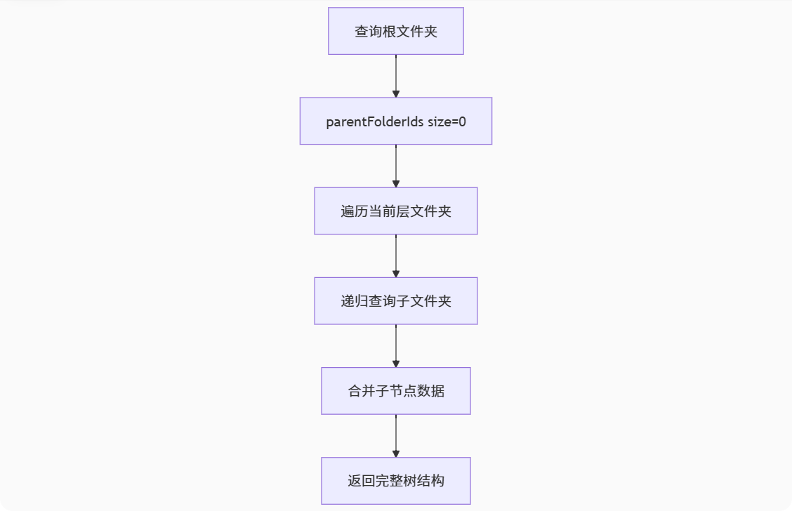
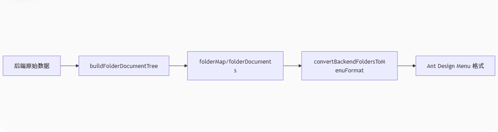
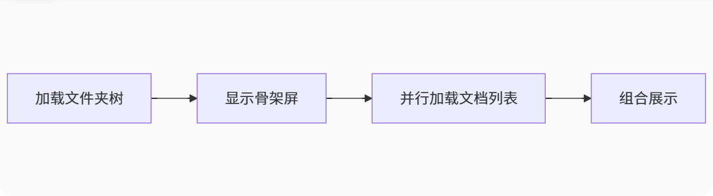
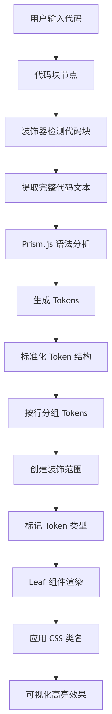

# 王梓绵答辩

> [!TIP]
>
> 各位导师好！我是广东工业大学2027届软件工程的王梓绵。😎
>
> 我开始接触前端是在大一下学期。之前参与过广东武警医院的智慧仓库项目开发,上学期就职于广东长正科技有限公司，担任前端实习生,实习期间参与公司内部erp项目的开发。
>
> 平时个人会在博客上发布一些文章来记录学习，热爱前端。


## 1. 文件夹和文档模块
第一部分是文件夹和文档模块的设计与实现,实现了文件夹与文档的创建、删除、重命名等功能。
支持用户更改权限,权限修改为公开的时候,该用户的所有文件夹与文档会开发为协同模式,存放到协同空间目录里面,其他用户可以共同编辑。

### 1.1 难点:
难点在于如何构建文件夹与文档之间之间的嵌套关系以及目录树的构建、文档初始化唯一命名。

#### 目录树构建算法：
后端采用 `buildFolderTree` 递归查询算法：
1. 从根文件夹开始（`parentFolderIds: { $size: 0 }`）
2. 使用 `Promise.all` 并行递归构建每个文件夹的子树
3. 返回完整的**文件夹**嵌套树结构

#### 前端处理流程：
1. 通过 `convertBackendFoldersToMenuFormat` 将文件夹树转换为 Ant Design Menu 格式
2. 使用 `buildFolderDocumentTree` 工具函数创建文件夹-文档映射关系
3. 将文档按照其 `parentFolderIds` 分配到对应的文件夹节点下

#### 1.1.1 后端树结构构建



*图：后端递归构建文件夹树的流程示意图*

**核心方法：`buildFolderTree`（递归构建）**
```javascript
/**
 * 后端递归构建文件夹树的核心方法
 * @param parentFolderId - 父文件夹ID
 * @param userId - 用户ID
 * @param currentDepth - 当前深度
 * @param maxDepth - 最大深度限制
 */
private async buildFolderTree(
  parentFolderId: string | null = null,
  userId?: string,
  currentDepth: number = 0,
  maxDepth?: number,
): Promise<FolderTreeResponse> {
  // 1. 构建查询条件
  const filter: FilterQuery<Folder> = {};
  
  // 根据父文件夹ID筛选
  if (parentFolderId) {
    filter.parentFolderIds = parentFolderId;
  } else {
    filter.parentFolderIds = { $size: 0 }; // 查询根目录文件夹
  }
  
  // 2. 查询当前层级的文件夹
  const folders = await this.folderModel
    .find(filter)
    .sort({ folderName: 1 })
    .lean()
    .exec();
  
  // 3. 递归构建子文件夹树
  const foldersWithChildren = await Promise.all(
    folders.map(async (folder): Promise<FolderTreeItem> => {
      // 递归调用构建子文件夹
      const children = await this.buildFolderTree(
        folder._id.toString(),
        userId,
        currentDepth + 1,
        maxDepth,
      );
      
      // 构建完整的树节点
      return {
        folderId: folder._id.toString(),
        autoFolderId: folder.folderId,
        folderName: folder.folderName,
        userId: folder.userId,
        parentFolderIds: folder.parentFolderIds,
        depth: folder.depth,
        childrenCount: {
          documents: folder.all_children_documentId?.length || 0,
          folders: folder.all_children_folderId?.length || 0,
        },
        children: children.data, // 递归的子节点
        create_time: folder.create_time,
        update_time: folder.update_time,
      };
    }),
  );
  
  return {
    success: true,
    message: `查询文件夹树形结构成功`,
    data: foldersWithChildren,
  };
}
```
#### 1.1.2 文件夹-文档关系映射
**核心方法**：buildFolderDocumentTree

- 创建 folderDocuments 映射表（文件夹ID → 文档数组）

- 遍历所有文档，根据其 parentFolderIds 分配到对应文件夹

- 特殊处理：无父文件夹的文档归入 ROOT 类别
```javascript
/**
 * 构建文件夹和文档的关系映射
 * @param folders - 文件夹数组
 * @param documents - 文档数组
 */
static buildFolderDocumentTree(folders = [], documents = []) {
  // 1. 创建文件夹ID映射
  const folderMap = new Map();
  
  // 递归收集所有文件夹ID
  const collectFolderIds = folderList => {
    folderList.forEach(folder => {
      folderMap.set(folder.folderId, folder);
      if (folder.autoFolderId) {
        folderMap.set(folder.autoFolderId, folder);
      }
      
      // 递归处理子文件夹
      if (folder.children && folder.children.length > 0) {
        collectFolderIds(folder.children);
      }
    });
  };
  
  collectFolderIds(folders);
  
  // 2. 创建文档分类映射
  const folderDocuments = new Map();
  
  // 根据parentFolderIds将文档分配到对应的文件夹
  documents.forEach(doc => {
    const parentIds = doc.parentFolderIds || [];
    
    if (parentIds.length === 0) {
      // 根级文档
      if (!folderDocuments.has('ROOT')) {
        folderDocuments.set('ROOT', []);
      }
      folderDocuments.get('ROOT').push(doc);
    } else {
      // 获取直接父文件夹ID
      const directParentId = parentIds[parentIds.length - 1];
      const parentFolder = folderMap.get(directParentId);
      
      if (parentFolder) {
        const folderId = parentFolder.folderId;
        if (!folderDocuments.has(folderId)) {
          folderDocuments.set(folderId, []);
        }
        folderDocuments.get(folderId).push(doc);
      }
    }
  });
  
  return {
    folderMap,
    folderDocuments,
    rootDocuments: folderDocuments.get('ROOT') || [],
  };
}
```
#### 1.1.3 前端树结构处理
**核心方法**：convertBackendFoldersToMenuFormat
负责递归遍历文件夹树，并将每个文件夹节点转换为菜单节点，同时将对应文件夹下的文档作为子节点（叶子节点）加入
```javascript
/**
 * 将后端文件夹数据转换为前端菜单格式
 * @param backendFolders - 后端文件夹数据
 * @param documents - 文档数据
 */
const convertBackendFoldersToMenuFormat = (backendFolders, documents = []) => {
  // 1. 使用工具函数构建文件夹和文档的映射关系
  const { folderDocuments, rootDocuments } = 
    folderUtils.buildFolderDocumentTree(backendFolders, documents);
  
  // 2. 递归转换后端文件夹数据为前端菜单格式
  const convertFolderToMenuItem = folder => {
    const menuItem = {
      key: folder.folderId,
      autoFolderId: folder.autoFolderId,
      icon: React.createElement(FolderOpenOutlined),
      label: <EllipsisLabel text={folder.folderName} />,
      children: [],
      backendData: folder,
      depth: folder.depth || 0,
      parentFolderIds: folder.parentFolderIds || [],
      childrenCount: folder.childrenCount || { documents: 0, folders: 0 },
    };
    
    // 3. 递归处理子文件夹
    if (folder.children && folder.children.length > 0) {
      menuItem.children = folder.children.map(childFolder =>
        convertFolderToMenuItem(childFolder),
      );
    }
    
    // 4. 添加文档到当前文件夹
    const folderDocumentList = folderUtils.getDocumentsByFolderId(
      folderDocuments,
      folder.folderId,
    );
    
    const documentMenuItems = folderDocumentList.map(doc => ({
      key: `doc_${doc.documentId}`,
      label: <EllipsisLabel text={doc.documentName} />,
      isLeaf: true,
      backendData: doc,
      documentId: doc.documentId,
    }));
    
    // 5. 合并文件夹和文档
    menuItem.children = [...(menuItem.children || []), ...documentMenuItems];
    
    return menuItem;
  };
  
  // 6. 转换所有根级文件夹
  const folderTree = backendFolders.map(folder => convertFolderToMenuItem(folder));
  
  return folderTree;
};

```


*图：前端树处理流程示意图*

*Ant Design Menu格式*

```javascript
const items = [
  {
    key: '1',
    icon: <MailOutlined />,
    label: 'Navigation One',
    children: [
      { key: '11', label: 'Option 1' },
      { key: '12', label: 'Option 2' },
      { key: '13', label: 'Option 3' },
      { key: '14', label: 'Option 4' },
    ],
  },
  {
    key: '2',
    icon: <AppstoreOutlined />,
    label: 'Navigation Two',
    children: [
      { key: '21', label: 'Option 1' },
      { key: '22', label: 'Option 2' },
      {
        key: '23',
        label: 'Submenu',
        children: [
          { key: '231', label: 'Option 1' },
          { key: '232', label: 'Option 2' },
          { key: '233', label: 'Option 3' },
        ],
      },
      {
        key: '24',
        label: 'Submenu 2',
        children: [
          { key: '241', label: 'Option 1' },
          { key: '242', label: 'Option 2' },
          { key: '243', label: 'Option 3' },
        ],
      },
    ],
  },
  {
    key: '3',
    icon: <SettingOutlined />,
    label: 'Navigation Three',
    children: [
      { key: '31', label: 'Option 1' },
      { key: '32', label: 'Option 2' },
      { key: '33', label: 'Option 3' },
      { key: '34', label: 'Option 4' },
    ],
  },
];
```
### 1.2 总结这个方法有什么好处：


*图：构建总结流程图*

#### 1. 我们当前的设计是将文件夹树的构建和文档的分配分离，具体来说： 
后端只负责构建文件夹的树形结构（通过递归查询文件夹表），前端在拿到文件夹树和文档列表（单独请求的）后，通过`buildFolderDocumentTree`方法将文档分配到对应的文件夹节点（包括根节点） 而另一种常见的做法是：在后端构建树的时候同时查询文档，将文档作为叶子节点直接构建到树中。 
#### 2. 当前设计的好处： 
1. *职责分离，结构清晰*：  
-  文件夹树和文档属于不同的数据类型，分开处理使得逻辑更清晰。   
-  将文档处理放在前端，可以避免每次文档结构变动都要重新构建整个树（包括文档）。
2.  *减少后端计算压力*：
-  如果一起构建，后端需要同时处理文件夹和文档的递归，尤其是在文档数量很大的情况下，构建整个树的开销会很大。 
- 当前设计下，后端只处理文件夹（通常数量远少于文档），文档的处理放在前端，利用浏览器的计算能力。
3.  *灵活性*： 
- 前端可以独立获取文档列表（例如按条件过滤），然后根据需求动态地分配到文件夹树中。如果文档列表需要更新（比如用户搜索），我们只需要重新运行`buildFolderDocumentTree`方法，而不需要重新请求整个文件夹树。 
-  如果文档和文件夹树一起构建，那么每次文档更新（比如新增一个文档）都需要重新构建整个树并返回，这在文档数量大时效率低下。
4. *支持文档懒加载*： 
- 当前设计可以轻松实现文档的懒加载。例如，一开始只加载文件夹树，当用户展开某个文件夹时，再去请求该文件夹下的文档，然后动态添加到已有的树中。这样可以显著提高初始加载速度。而如果一开始就把所有文档都构建在树中，那么初始加载的数据量会非常大。  

#### 1.3 生成唯一默认文件名/文件夹名


##### 1.3.1 逻辑步骤
**（1） 收集现有名称**：

- 创建一个 Set 集合 existingNames 存储所有不可重复的名称。

- 添加额外名称：遍历 additionalNames 参数，将非空名称添加到集合中。

- 递归查找目标文件夹

- 处理根目录：若 targetKey === 'root'，直接查找根节点（key='root'）的子项名称。

**（2） 生成唯一名称**：

- 初始化计数器 counter = 1，生成候选名称 candidateName = baseName + counter。

- 循环检查：若 candidateName 在 existingNames 中存在，则 counter++ 并生成新名称。

- 返回结果：直到找到不在集合中的名称，返回最终的 candidateName。

##### 1.3.2 关键代码：
```javascript
  /**
   * 生成唯一的默认文件名/文件夹名，避免同级目录下的重复
   * @param {string} baseName - 基础名称，如"新建文档"或"新建文件夹"
   * @param {string} targetKey - 目标文件夹的key
   * @param {Array} additionalNames - 额外需要检查的名称列表（如后端最新数据）
   * @returns {string} 唯一的名称
   */
  const generateUniqueDefaultName = (
    baseName,
    targetKey,
    additionalNames = [],
  ) => {
    // 获取目标文件夹的现有子项
    const getExistingNames = () => {
      const existingNames = new Set();

      // 添加额外的名称列表（来自后端的最新数据）
      additionalNames.forEach(name => {
        if (name) existingNames.add(name);
      });

      // 递归查找目标文件夹及其子项
      const findTargetFolderItems = (nodes, key) => {
        for (const node of nodes) {
          if (node.key === key) {
            // 找到目标文件夹，收集其子项名称
            if (node.children) {
              node.children.forEach(child => {
                const name = child.label?.props?.text || child.label;
                if (name) {
                  existingNames.add(name);
                }
              });
            }
            return true;
          }
          if (node.children) {
            if (findTargetFolderItems(node.children, key)) {
              return true;
            }
          }
        }
        return false;
      };

      // 如果是根目录
      if (targetKey === 'root') {
        const rootFolder = folderList.find(item => item.key === 'root');
        if (rootFolder && rootFolder.children) {
          rootFolder.children.forEach(child => {
            const name = child.label?.props?.text || child.label;
            if (name) {
              existingNames.add(name);
            }
          });
        }
      } else {
        findTargetFolderItems(folderList, targetKey);
      }

      return existingNames;
    };

    const existingNames = getExistingNames();

    console.log('现有名称集合:', [...existingNames]);

    // 从1开始尝试生成唯一名称
    let counter = 1;
    let candidateName = `${baseName}${counter}`;

    while (existingNames.has(candidateName)) {
      counter++;
      candidateName = `${baseName}${counter}`;
    }

    console.log('生成的唯一名称:', candidateName);
    return candidateName;
  };
```

## 2. slate中编辑器代码块高亮
第二部分是实现了slate中编辑器代码块高亮的功能,主要是基于 Slate 的装饰器机制和 Prism.js 的语法分析能力去实现的。



*图：前端代码高亮处理流程示意图*
### 2.1 流程总结：
1. 用户操作：点击代码块按钮，将选中的段落转换为代码块结构
2. 语法分析：使用Prism.js对代码文本进行词法分析，生成tokens
3. Token标准化：将嵌套的token结构展平并按行分组
4. 装饰器应用：为每个token创建装饰信息，标记类型和位置
5. 渲染输出：Leaf组件将装饰器属性转换为相应的CSS类名
6. 样式生效：通过Prism主题CSS实现语法高亮效果

### 2.2 数据结构设计
```javascript
// 代码块容器节点
{
  type: 'code-block',
  language: 'javascript', // 当前代码块使用的语言
  children: [
    // 代码行节点
    {
      type: 'code-line',
      children: [{ text: 'function test() {' }] // 实际代码文本
    },
    {
      type: 'code-line',
      children: [{ text: '  console.log("Hello");' }]
    },
    // ...更多行
  ]
}
```
### 2.3 Prism.js词法分析
```javascript
// 代码高亮装饰器函数
function decorate([node, path]) {
  let decorations = [];
  if (!node || !path) return decorations;
  
  // 检查是否为代码块
  if (Element.isElement(node) && node.type === 'code-block') {
    decorations = decorations.concat(decorateCodeBlock([node, path]));
  }
  
  return decorations;
}

// 为代码块应用语法高亮装饰
const decorateCodeBlock = ([block, blockPath]) => {
  try {
    // 1. 提取代码文本
    const text = block.children.map(line => Node.string(line)).join('\n');
    // 1.将代码块节点（block）的所有子行（children）拼接成一个完整的代码字符串。
    // 2.Node.string(line)：Slate.js的API，用于提取节点中的​​纯文本内容​​，忽略所有格式、标签等非文本元素。
    const language = block.language || 'html';
    
    // 2. 检查语言支持
    if (!Prism.languages[language]) {
      return [];
    }
    
    // 3. 使用Prism.js进行词法分析
    const tokens = Prism.tokenize(text, Prism.languages[language]);
    
    // 4. 标准化tokens，按行分组
    const normalizedTokens = normalizeTokens(tokens);
    
    // 5. 为每个token创建装饰信息
    const decorations = [];
    for (let index = 0; index < normalizedTokens.length; index++) {
      const tokens = normalizedTokens[index];
      let start = 0;
      
      for (const token of tokens) {
        const length = token.content.length;
        if (!length) continue;
        
        const end = start + length;
        const path = [...blockPath, index, 0]; // 定位到具体的代码行
        
        // 创建装饰对象
        const decoration = {
          anchor: { path, offset: start },
          focus: { path, offset: end },
          token: true,
        };
        
        // 为每个token类型添加标记
        token.types.forEach(type => {
          decoration[type] = true;
        });
        
        decorations.push(decoration);
        start = end;
      }
    }
    
    return decorations;
  } catch (error) {
    console.error('代码高亮处理失败:', error);
    return [];
  }
};
```
**2.3.1 Token标准化处理**
```javascript
// 标准化Prism.js生成的tokens
export const normalizeTokens = tokens => {
  const lines = [[]];
  let currentLine = 0;

  const processToken = (token, types = []) => {
    if (typeof token === 'string') {
      // 处理纯文本，按换行符分割
      const parts = token.split('\n');
      for (let i = 0; i < parts.length; i++) {
        if (i > 0) {
          // 遇到换行符，创建新行
          currentLine++;
          lines[currentLine] = [];
        }
        if (parts[i]) {
          lines[currentLine].push({
            types,
            content: parts[i],
          });
        }
      }
    } else if (typeof token === 'object' && token !== null) {
      // 处理复杂的token对象
      if (token.content) {
        const newTypes = token.type ? [...types, token.type] : types;
        if (Array.isArray(token.content)) {
          token.content.forEach(subToken => processToken(subToken, newTypes));
        } else {
          processToken(token.content, newTypes);
        }
      }
    }
  };

  tokens.forEach(token => processToken(token));
  
  // 确保每一行都有内容
  return lines.map(line =>
    line.length === 0 ? [{ types: [], content: '' }] : line,
  );
};
```
### 2.4 渲染层实现
#### 2.4.1 代码块容器渲染
```javascript
// Element.jsx - 代码块容器渲染
case 'code-block':
  const setLanguage = language => {
    const path = ReactEditor.findPath(editor, element);
    Transforms.setNodes(editor, { language }, { at: path });
  };

  return (
    <div
      {...attributes}
      style={{
        fontFamily: 'monospace',
        fontSize: '16px',
        lineHeight: '20px',
        background: 'rgba(0, 20, 60, .03)',
        padding: '5px 13px',
        position: 'relative',
        borderRadius: '8px',
        border: '1px solid #e1e5e9',
      }}
      spellCheck={false}
    >
      <LanguageSelect
        value={element.language || 'html'}
        onChange={e => setLanguage(e.target.value)}
      />
      {children}
    </div>
  );
```
#### 2.4.2 叶子节点高亮渲染
```javascript

const Leaf = ({ attributes, children, leaf }) => {
  // 提取 token 类型
  const tokenClasses = Object.keys(leaf).filter(
    cls => !['text', 'token'].includes(cls)
  );
  
  if (tokenClasses.length > 0) {
    return (
      <span
        {...attributes}
        className={`token ${tokenClasses.join(' ')}`}
      >
        {children}
      </span>
    );
  }
  
  return <span {...attributes}>{children}</span>;
};
```

### 2.5 满足 Prism.js 的输入要求：Prism.js 语法分析器需要完整的代码字符串作为输入
```javascript
const text = block.children.map(line => Node.string(line)).join('\n');
```
#### 步骤 1: block.children.map(...)
- block.children 获取代码块的所有子节点（即所有代码行）
- map() 方法遍历每个代码行节点
#### 步骤 2: Node.string(line)
- 这是 Slate.js 提供的 API 方法
- 作用：提取节点及其所有子节点的纯文本内容
- 对于简单文本节点，直接返回文本内容
- 对于包含格式的文本（如粗体、斜体），只返回纯文本
#### 步骤 3: .join('\n')
- 将每行代码的文本数组连接成一个字符串
- 在每行之间添加换行符 \n
- 生成完整的代码字符串
#### 示例演示
- 假设编辑器中有以下代码块：
```javascript
  function hello() {
      console.log("你好");
  }
```
- 在 Slate 中的数据结构：
```javascript
{
  type: 'code-block',
  language: 'javascript',
  children: [
    { type: 'code-line', children: [{ text: 'function hello() {' }] },
    { type: 'code-line', children: [{ text: '  console.log("你好");' }] },
    { type: 'code-line', children: [{ text: '}' }] }
  ]
}
```
- 代码执行结果：
```javascript
// 第一步：map 操作
[
  'function hello() {',
  '  console.log("你好");',
  '}'
]

// 第二步：join('\n')
`function hello() {
  console.log("你好");
}`
```
### 2.6 词性分析
```javascript
const tokens = Prism.tokenize(text, Prism.languages[language]);
```
- 输入：
  - text: 完整代码字符串
  - Prism.languages[language]: 指定语言的语法规则
- 输出：嵌套的 token 结构（尚未标准化）
示例：
当遇到复杂语法结构时，Prism.js 会产生多层嵌套：
1. 多层嵌套结构
```javascript
// 示例：模板字符串
`Hello ${name}!`

// 对应的嵌套 token
{
  type: "template-string",
  content: [
    "`Hello ",
    {
      type: "interpolation",
      content: [
        {
          type: "punctuation",
          content: "${"
        },
        {
          type: "variable",
          content: "name"
        },
        {
          type: "punctuation",
          content: "}"
        }
      ]
    },
    "!`"
  ]
}
```
2. 数组嵌套
```javascript
// JSX 示例
<div className="test">{value}</div>

// 对应的 token 结构
[
  {
    type: "tag",
    content: [
      { type: "punctuation", content: "<" },
      { type: "tag", content: "div" },
      { type: "space", content: " " },
      { type: "attr-name", content: "className" },
      { type: "operator", content: "=" },
      { type: "string", content: '"test"' },
      { type: "punctuation", content: ">" }
    ]
  },
  {
    type: "interpolation",
    content: [
      { type: "punctuation", content: "{" },
      { type: "variable", content: "value" },
      { type: "punctuation", content: "}" }
    ]
  },
  {
    type: "tag",
    content: [
      { type: "punctuation", content: "<" },
      { type: "punctuation", content: "/" },
      { type: "tag", content: "div" },
      { type: "punctuation", content: ">" }
    ]
  }
]
```
### 2.7 Token 标准化处理
```javascript
const normalizedTokens = normalizeTokens(tokens);
```
- 目的：将 Prism 的嵌套 token 转换为按行分组的扁平结构
- 输入：Prism 原始 token 数组
- 输出：二维数组 lines[][]，每行包含该行的 tokens
- 关键转换：
```javascript
//输入：
function test() {
    return;
}
// 转换前（Prism 原始输出）
["function", " ", "test()", " ", "{", "\n", "  return;", "\n", "}"]

// 转换后（标准化）
[
  [ // 行1
    { types: ["keyword"], content: "function" },
    { types: [], content: " " },
    { types: ["function"], content: "test()" },
    // ...
  ],
  [ // 行2
    { types: [], content: "  " },
    { types: ["keyword"], content: "return" },
    // ...
  ]
]
```
## 3. 打包DocEditor为一个开箱即用的富文本编辑器组件库
基于 Vite 构建了一个开箱即用的富文本编辑器React组件库 DocEditor。支持双模输出格式，结合 Rollup 的外部化配置，将 React、Slate 编辑器核心和 Ant Design 等重量级依赖完全外部化（在使用该库时需要自行安装这些依赖）减少最终产物体积，使得这个富文本编辑器能无缝集成到其他项目中作为组件使用，体现了现代前端工程化的思想。
### 3.1 关键代码：
```javascript
import { defineConfig } from 'vite';
import react from '@vitejs/plugin-react';

export default defineConfig({
  // 1. 插件配置
  plugins: [react()],
  
  // 2. 构建配置
  build: {
    // 2.1 库模式配置
    lib: {
      entry: 'src/index.jsx',         // 入口文件路径
      name: 'DocEditor',              // 库的全局变量名
      fileName: format => `doc-editor.${format}.js`, // 输出文件名格式
      formats: ['es', 'umd'],         // 输出格式：ES模块和UMD
    },
    
    // 2.2 Rollup 高级配置
    rollupOptions: {
      // 外部化依赖 - 不打包进库
      external: [
        'react',
        'react-dom',
        'slate',
        'slate-react',
        '@ant-design/icons',
        'antd',
      ],
      
      // 输出配置
      output: {
        exports: 'named', // 使用命名导出
        // 全局变量映射 - 为UMD格式提供全局变量名
        globals: {
          react: 'React',
          'react-dom': 'ReactDOM',
          slate: 'Slate',
          'slate-react': 'SlateReact',
          '@ant-design/icons': 'AntDesignIcons',
          antd: 'antd',
        },
      },
    },
  },
  
  // 3. 开发服务器配置
  server: {
    open: true,   // 启动时自动打开浏览器
    port: 5175,   // 指定开发服务器端口
  },
  
  // 4. 路径解析配置
  resolve: {
    alias: {
      '@': '/src', // 路径别名
    },
  },
  
  // 5. 环境条件配置
  ...(process.env.NODE_ENV !== 'production' && {
    build: undefined,    // 开发环境禁用构建配置
    root: '.',           // 设置项目根目录
    publicDir: false,    // 禁用公共目录
    appType: 'spa',      // 应用类型为单页应用
  }),
});
```
## 4.心得体会

在这次飞书前端训练营的学习中，我有了跨越式的成长。我们团队打造的DocCollab协同文档编辑系统还原了类飞书文档的真实业务场景，训练营培养模式让我不仅掌握了文件夹文档管理、CRDT冲突解决算法、Slate-Yjs协同编辑框架等前沿技术，更在Git协作规范、Code Review机制中培养了工程化协作意识。

从需求分析、技术选型、架构设计到最终实现，每个环节都让我对软件开发的完整流程有了更清晰的认识。特别感谢本次训练营精心设计的渐进式挑战任务，不仅让我掌握了协同编辑的核心技术，更重要的是培养了我解决复杂工程问题的思维方式,相信这些经验将为我未来的职业发展奠定坚实基础。
