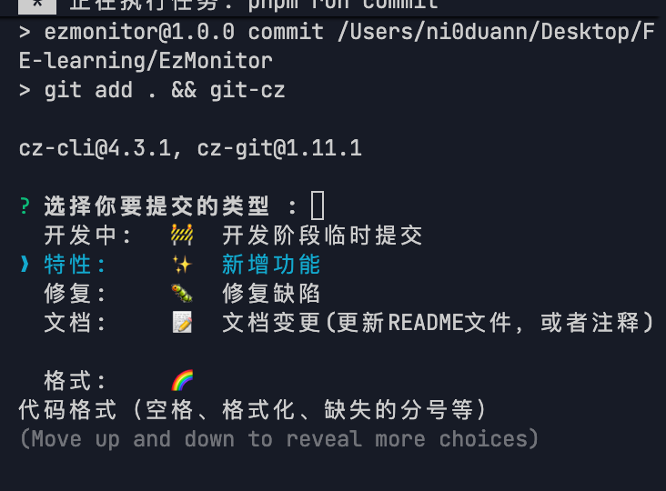

# 贡献指南

感谢您考虑为DocCollab项目做出贡献！本文档将指导您如何参与项目开发和贡献代码。

## 开发环境搭建

### 环境要求

- Node.js 18+
- MongoDB 6.0+
- pnpm 10.4.1+

### 初始化项目

```bash
# 克隆项目
git clone https://github.com/byteGanYue/DocCollab.git
cd DocCollab

# 安装依赖
pnpm install

# 初始化git钩子
pnpm prepare
```

## 项目结构

DocCollab使用Monorepo架构，主要包含以下几个包：

- **doc-web**：React前端应用
- **doc-server**：NestJS后端服务
- **doc-editor**：协同编辑器组件库
- **doc-docs**：项目文档站点

## 开发流程

### 分支管理

- `main`: 主分支，稳定版本
- `dev`: 开发分支，最新特性
- `feature/*`: 功能分支，用于开发新功能
- `fix/*`: 修复分支，用于修复bug

### 常用命令

```bash
# 启动前端开发服务
pnpm dev:doc-web

# 启动后端服务
cd packages/doc-server
pnpm start:dev

# 构建所有项目
pnpm build:all

# 启动文档开发服务
pnpm docs:dev
```

## 提交规范

我们使用[Conventional Commits](https://www.conventionalcommits.org/)规范进行代码提交。项目已配置Commitizen工具，可以通过以下命令进行规范化提交：

```bash
pnpm commit
```

提交类型包括：

- `feat`: 新功能
- `fix`: 修复bug
- `docs`: 文档更新
- `style`: 代码风格更改
- `refactor`: 代码重构
- `perf`: 性能优化
- `test`: 测试相关
- `build`: 构建相关
- `ci`: CI配置相关
- `chore`: 其他更改

提交示例：



## 代码规范

项目使用ESLint和Prettier进行代码格式化和检查。在提交代码前，请确保运行以下命令检查代码：

```bash
# 检查代码格式
pnpm lint

# 自动修复问题
pnpm lint:fix
```

## Pull Request流程

1. Fork项目并clone到本地
2. 创建新分支（feature/xxx或fix/xxx）
3. 开发新功能或修复bug
4. 确保代码通过lint检查和测试
5. 提交代码（使用`pnpm commit`）
6. 推送到你的fork仓库
7. 创建Pull Request到原仓库的dev分支

## 如何联系我们

- GitHub Issues: https://github.com/byteGanYue/DocCollab/issues
- [byteGanYue团队](https://byteGanYue.github.io/DocCollab/about.html)
